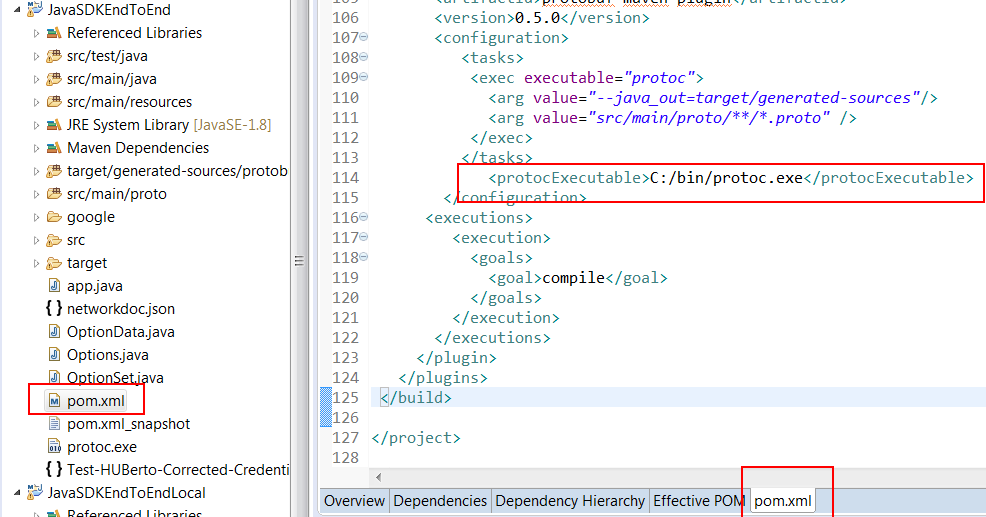

This document shows you how to work on a Hyperledger Fabric Java SDK eclipse project. 

## Get to know JSDKIntegrationSample

Follow https://github.com/IBM-Blockchain/JSDKIntegrationSample sample to understand how to create a BlueMix Blockchain
network, how to copy ServiceCredential to your local bmxServiceCredentials.json, how to upload the certificate to Members Certificates by clicking "Add Certificate".

## Import the Java project to the eclipse workspace

 a. Right click on any blank space of the workspace under "Package Explorer", select "Import", once the new window pop up,
 choose General --> Existing Projects into Workspace then click on the "next" button.
 
 
 
 
 b. Choose "Select archive file: " radio button, then click on "Browse" to open the Java project zip (JSDKSampleIntegration.zip) file then click on "Finish".
  
  

## How to compile protobuf from eclipse

 Since Fabric hyperledger Java-SDK has .proto files, if you want to customize those files, you need to have protoc compiler in your eclipse project. The following steps show you how to enable protoc compiler in your eclipse project.
 
 a. Download protobuf-java-3.4.1.tar.gz from https://github.com/google/protobuf/releases
              (choose the right version and platform format zip/tar files)
			  
 b. Extract the zip/tar file, then run ./configure.
 
 c. Run make
 
 d. Run sudo make install
 
 e. The executable protoc file will be generated to /usr/local/bin/
 
 f. Add protobuf-java dependency entry to the pom.xml.
 
 
 
 
 g. The following lines should show up at your pom.xml

  

 ## How to install and config the Eclipse Checkstyle Plugin
 
 1. Install the Plugin
 
    a. Start a WWW browser and navigate to http://eclipse-cs.sourceforge.net/.
	
	b. Start Eclipse.
	
	c. Drag the "Install" icon from the WWW browser into a running Eclispe workspace.
	
	d. When the dialog box appears, check "Checkstyle Plug-in" and click on Confirm.
	
	
	
	e. Check "I accept..." and click on Finish.
	
	
	
	f. If you get a message about "unsigned content", click OK.
	
	
	
	g. Restart Eclipse.
	
 2. Enable the Checkstyle Plugin
   
    To enable the Checkstyle plugin for a particular project,
   
      Right-click on the project.
   
      
   
      Click on Checkstyle and Activate Checkstyle. 
   
 3. Load a Checkstyle File
   
    If you need to use the customized checks file, follow the steps below.
   
    i). Download the file to your local file system.
    
    ii). In Eclipse, right-click on the project, and pull down to Properties.
    
    iii). Select "Checkstyle" and click on the "Local Check Configurations" tab.
    
    iv). Click on New.
    
       
    
    v). Select "External Configuration File".
    
       

       enter a "Name:" and the "Location:" of the file, and click OK.
    
       
	
    vi). Select the "Main" tab.
	
    vii). Select the appropriate configuration file from the drop-down list.
	
	   
    
    viii). Click on OK.
    
    ix). When the "Rebuild suggested" dialog appears, click on Yes.
	
	